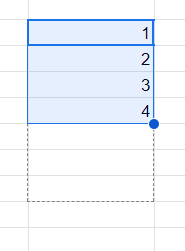
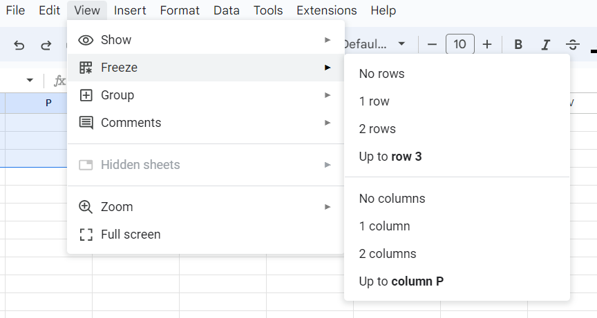
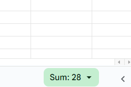
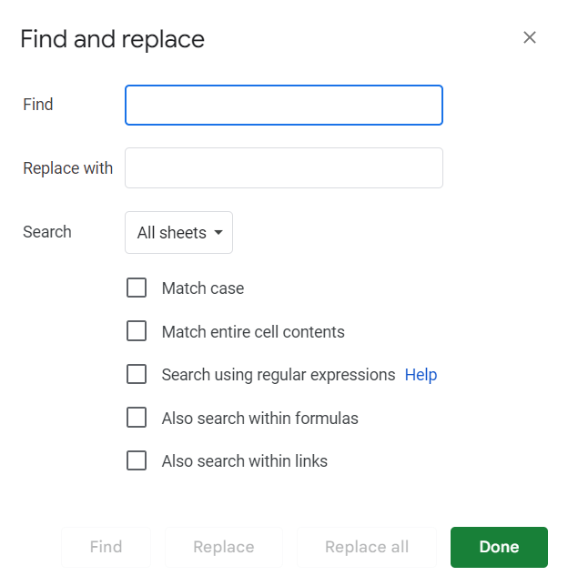
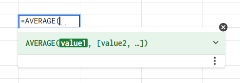
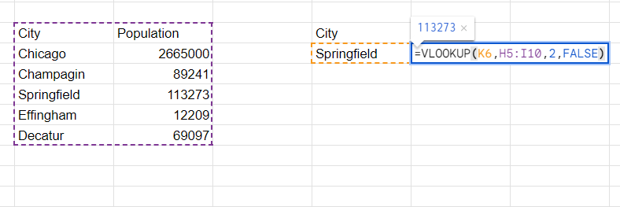

# Sheets in a hurry 
Need a quickcheat sheet to remember some basic Google Sheets stuff? Here you go. Almost everything here works either identically in Microsoft Excel, LibreOffice Calc and OpenOffice Calc (or nearly identically), so this can also serve as a guide to basically any spreadsheet software.  

## General UI stuff
+ **Drag to duplicate.** To copy a formula across multiple cells, drag from the bottom right corner. This will copy any cells referenced in that formula _relative to the position of the original cell_. 

  

+ **A$1 =/= A1.** If you don't want to changethe original cell you're referencing (such as if you're dividing all cells in a table by the contents of a specefic cell), you can add a "$" to the cell name in the formula. For example, dragging down from a formula referncing A1 (the top left cell) will change it to A2, A3, and so on. Changing it to A$1 will keep it the same. Dragging to the right will change it to B1, C1, D1, etc. $A1 will keep it constant. You can also use $A$1 to keep it the same in both directions. 

+ **Freeze rows and columns.** You will often want to make sure you can see the top row (headers) at all times. Sometimes you might want to keep the frst column or two in view at all times. Go to View --> Freeze to keep those in place, even when you scroll. 

  

+ **Filters.** Super useful way of only seeing data you care about. Hides all the data that doesn't match a condition, e.g. "hide all rows that have "HOFFMAN" in this column. Under Data --> Filter. I almost awlays toss a filter on every column, just in case. Relatively straightforward UI. 

+ **Sheets.new.** Type this into your URL bar and it opens a new sheet. Incredibly useful, but be sure to save it somewhere you'll find it or your Google Drive root folder will become a mess. 
+ **Google magic.** Sheets has a wonderful feature where if you select a range, it will privide you with the sum, average, min, max and count of that range. You can do this with formulas, but sometimes it's just easier to get it quicker this way. 

  

+ **Strings.** Like almost any computer software, Sheets interprets numbers and words diferently than how you might imagine it. CS nerds call words "strings" and in Sheets, if you want a word to be represented in a formula, you need to enclose it in quote marks (like "this") for the softwareto recognize it as a word. Anything not in quote marks will be part of the formula name and will break stuff. 

+ **Ctrl-F.** Ctrl-F opens up a little dialogue in the top right to search for stuff in a sheet. Sper useful. 

  

+ **Find and replace.** Even more useful is when you hit those three dots on the right of that box and it opens up a find and replace. If you're cleaning data and know that every single "p.m." should be formatted as "P.M." or vice versa, this is an incredibly useful tool. **Be warned** that this can screw up other cells if you're not careful, so restrict it to just the range you need to work with if you have to.  

## Formulas
+ **A note about the documentaton.** Every formula in Sheets has a documentation page. If you've ever done computer programming, this works the same way. The nice thing about these is that a shorthand pops up to remind you how to format it. Incredibly useful. 

  

+ **=AVERAGE(), =MEDIAN() and =SUM().** Calculates the mean, median and sum of a range. 
    + Format: =AVERAGE(value1, value2, value3, etc) OR =AVERAGE(range)
+ **=COUNT() and =COUNTUNIQE().** Calculates the number of values in a range (or the number of unique values in a range). 
    + Format: =COUNT(value1, value2, value3, etc) OR =COUNT(range)
+ **=UNIQUE().** Returns an array of every unique value from a range. 
    + Format: =UNNIQUE(value1, value2, value3, etc) OR =UNIQUE(range)
+ **=IF().** The most powerful Sheets formula. It performs an action based on a true/false condition that you specefy. You can format the condition using other formuals (see mbelow) or using math statements like greater/less than (>/<) and equals(=). Strings can be equal to each other! 
    + Format: =IF(condition, value if true, value if false)
    + I won't go into detail (Google it), but useful forumals for IF statements include: =NOT(), =OR(), =AND(), =ISBLANK(), =ISTEXT(), =ISDATE(), and more. 
+ **=SUBSTITUTE().** Swaps out a certain bit of text (i.e. a substring) for another within a bigger bit of text (string).
    + Format: SUBSTITUTE(text to search, search for, replace with, optional: how many times you want to replace it)
+ **=CONCATENATE() and &.** Used to combine strings. 
    + Format: =CONCATENATE(string1, string2, string3) OR =string1&string2&string3
+ **=LEN().** Returns the length of a string. 
    + Format: =LEN(string)
+ **=LEFT() and =RIGHT().** Returns a substring of a certain number of characters, conting from the left or right of a string. (Use it with =LEN() to cut off the beginnings and ends of strings. Google it if you're confused.)
    + Format: =LEFT(string, optional: number of characters). Nuber of characters defaults to 1. 
+ **=UPPER(), =LOWER() and =PROPER().** Changes the text case of string to UPPER CASE, LOWER CASE and Proper Case. 
    + Format: =UPPER(string)
+ **=VLOOKUP().** Used to look up values and import them from one table-formatted section of a spreadsheet to another. Can reference across sheets within the same file. 
    + Format: =VLOOKUP(search term, range to lookup, column the result is in, is the table sorted). The search term must appear in the first column of the range to lookup and the "is the table sorted" is almost always FALSE.

+ **=SPLIT() and =JOIN().** Used to split strings or join strings based on a "delimeter" (i.e. antother, usually shorter, string). 
    + Format: =SPLIT(text, delimter, optional: split by each, optional: remove empty text). Set split by each to FALSE if you are splitting based on a multi character string. This comes up a lot for me with splitting placenames by ", "
    + Format: =JOIN(delimiter, range) OR =JOIN(delimter, value1, value2, value3, etc)
+ **=DATE(), =DAY(), =MONTH() and =YEAR().** =DATE() creates a date formatted cell. =DAY(), =MONTH() and =YEAR() pull the respective part of a date out of a date formatted cell. This is useful if you have a bunch of dates formatted as strings, but want to swap them to dates or if you want to filter by year. 
    + Format: =DATE(year, month, day)
    + Format: =DAY(date)
    + =DATEDIF() is useful for calculating the difference between date formattes cells as well.  
+ **BONUS: =REGEXMATCH() and =REGEXEXTRACT().** A very powerful tool to search/match or extract a string from within a larger string. This is incredibly useful and also quite complicated. Google it or ask Andrew if you want to learn more. I'm not gonna tell you how to use it here, but just know this is the answer to the question "How do I search for something?" or "How do I check if a cell contains a specefic phrase?"

## Pivot tables 
Under Insert --> Pivot Table. Opens up a new sheet within the file with a pivot table. This allows you to create a new table that runs calculations for you. Usually only useful if you have data with multiple columns of interesting variables, if you need to filter stuff out, if you need to average across rows based on a condition or - as is often the case - you need to do all of that at once. 

It can be intimidating. Here is a [video workshop from GIJN](https://youtu.be/C9wAtU7HA8A?t=1305) (starts getting into pivots around 21 minutes) and a [written tutorial from Stanford](http://www.padjo.org/tutorials/spreadsheets/basic-pivot-tables/). 
