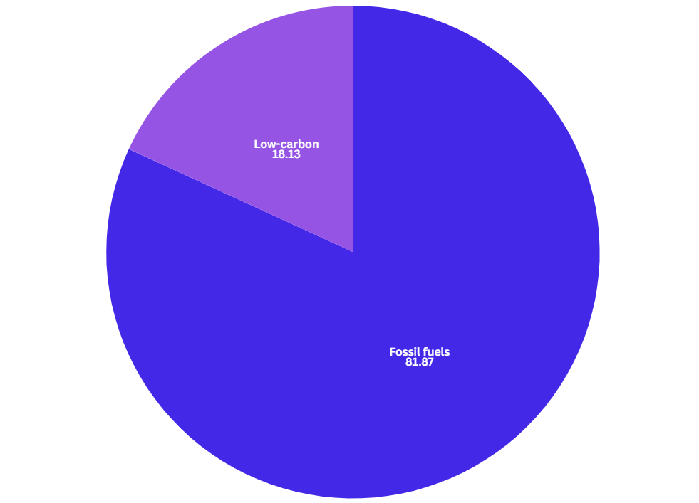

# Vizulaizing 101 

So you have some data - or you have an idea for a data story - but aren't sure how to present that data to readers. Great! This is a fun problem to have. Here is a guide on what type of visualizations work well for different types of data. 

Some things to remember: 
+ **Data exists to support the story.** A visualization only works if it helps to tell the story. It has to provide insight, encourage deeper understanding or help a reader navigate the topic or it's not doing it's job. 
+ **Keep it simple, stupid.** It's often fun to create an intricate or complex graphic or interactive, but these can be very confusing for readers. Sometimes, the right answer is the straightforward answer. Don't use 10 colors when you can use 2. Don't forget to explain yourself. Not veryone is data literate.  
+ **It's the news, not a research paper.** Be fun. Be engaging. Hold your readers' hands a little. 

Now onto the meat of this thing: a guide to different visualization types. 

Jump to a section: 
+ [Bar + column charts](#Bar-+-column-charts)

## Bar + column charts

Column charts, like the one above, and bar charts (imagine it rotated 90 degrees) are incredibly useful and represent the bread and butter of vizualizing data. They are almost universally understood and can show a lot of information quickly. 

### When to use: 
+ When comparing categorical data 
+ When you want to show difference or compare
+ When you have disjointed time series 
### Pros:
+ Incredibly easily understood
+ Incredibly easy to create 
+ Easy to annotate to highlight story elements
### Cons: 
+ Kind of boring 
+ Requires some legwork to make it visually interesting 
+ Introduces possible y-axis bias 

## Line charts

Line charts are also one f the most universally understood chart types. They are easy, quick and can look incredibly clean. 

### When to use: 
+ When you have a continuous time series (can often be swapped for bar charts)
### Pros:
+ Easy to annotate
+ Well understood 
### Cons: 
+ Like bar charts, can be boring 
+ Introduces possible y-axis bias 

## Area charts

Description

### When to use: 
+ When you have multiple continuous time series 
+ When you want to compare proportions of a whole over time 
### Pros:
+ Has a little bit more visual flair 
### Cons: 
+ Can be hard to read 
+ Introduces possible y-axis bias 

## Pie charts

Pie charts are terrible and I hate them. Here's [a discussion of why they're terrible](https://theconversation.com/heres-why-you-should-almost-never-use-a-pie-chart-for-your-data-214576) from The Conversation, a nonprofit news organization that bridges the gap between academic research and journalists. 

### When to use: 
+ Basically never, use a bar chart instead 
### Pros:
+ Shut up 
### Cons: 
+ Every possible con

## Tables 

Tables can be incredibly efficient ways of sharing small datasets or providing a lookup tool to readers. Be careful to _not_ use them in place of visualization. 

### When to use: 
+ For small datasets that you want to share
+ For lookup tools
+ For 
### Pros:
+ Super easily understood
+ Adds a layer of interactivity and engagement 
+ 
### Cons: 
+ Takes a lot of legwork to make it visually engaging
+ Can be confusing to readers if not executed properly 

## Pictograms 

Description

### When to use: 
+ When
### Pros:
+ Pro
### Cons: 
+ Con

## Choropleth maps

Description

### When to use: 
+ When
### Pros:
+ Pro
### Cons: 
+ Con

## Symbol + pin maps

Description

### When to use: 
+ When
### Pros:
+ Pro
### Cons: 
+ Con

## Scatter plots 

Description

### When to use: 
+ When
### Pros:
+ Pro
### Cons: 
+ Con

## Animations 

Description

### When to use: 
+ When
### Pros:
+ Pro
### Cons: 
+ Con

## Network graphs 

Description

### When to use: 
+ When
### Pros:
+ Pro
### Cons: 
+ Con

## Chord diagrams 

Description

### When to use: 
+ When
### Pros:
+ Pro
### Cons: 
+ Con

## Any random idea you have 