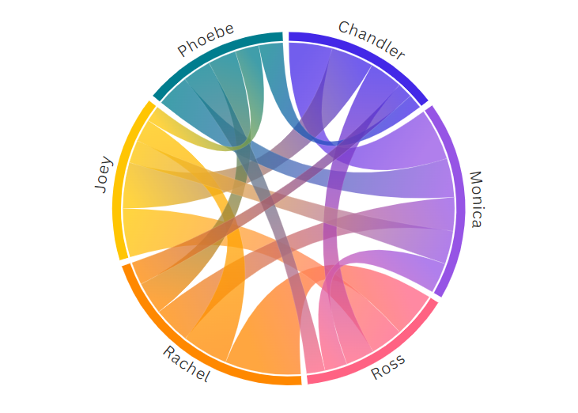
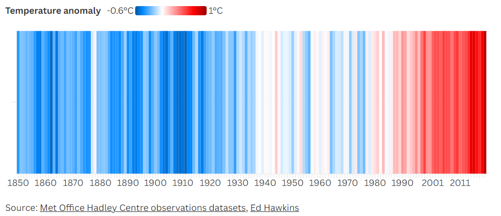

# Vizualaizing 101 
_last updated 2024-10-12_

So you have some data - or you have an idea for a data story - but aren't sure how to present that data to readers. Great! This is a fun problem to have. Here is a guide on what type of visualizations work well for different types of data. 

Some things to remember: 
+ **Data exists to support the story.** A visualization only works if it helps to tell the story. It has to provide insight, encourage deeper understanding or help a reader navigate the topic or it's not doing it's job. 
+ **Keep it simple, stupid.** It's often fun to create an intricate or complex graphic or interactive, but these can be very confusing for readers. Sometimes, the right answer is the straightforward answer. Don't use 10 colors when you can use 2. Don't forget to explain yourself. Not veryone is data literate.  
+ **It's the news, not a research paper.** Be fun. Be engaging. Hold your readers' hands a little. 

Now onto the meat of this thing: a guide to different visualization types. 

Jump to a section: 
+ [Bar + column charts](#bar--column-charts)
+ [Line charts](#line-charts)
+ [Area charts](#area-charts)
+ [Pie charts](#pie-charts)
+ [Tables](#tables)
+ [Pictograms](#pictograms)
+ [Choropleth maps](#choropleth-maps)
+ [Symbol and pin maps](#symbol--pin-maps)
+ [Scatter plots](#scatter-plots)
+ [Animations](#animations)
+ [Network graphs](#network-graphs)
+ [Chord diagrams](#chord-diagrams)
+ [Sankey diagrams](#sankey--alluvial-diagrams)
+ [Any random idea you have](#any-random-idea-you-have)

Images are taken from Flourish and Datawrapper examples and sample data, with a few thrown that I've created. There's one that I just lifted from GIPHY. You can find the link in the source for this page.  

 

# Bar + column charts

Column charts, like the one above, and bar charts (imagine it rotated 90 degrees) are incredibly useful and represent the bread and butter of vizualizing data. They are almost universally understood and can show a lot of information quickly. 

### When to use: 
+ When comparing categorical data 
+ When you want to show difference or compare
+ When you have disjointed time series 
### Pros:
+ Incredibly easily understood
+ Incredibly easy to create 
+ Easy to annotate to highlight story elements
### Cons: 
+ Kind of boring 
+ Requires some legwork to make it visually interesting 
+ Introduces possible y-axis bias

  

# Line charts

Line charts are also one of the most universally understood chart types. They are easy, quick and can look incredibly clean. 

### When to use: 
+ When you have a continuous time series (can often be swapped for bar charts)
+ To show trends over time
### Pros:
+ Easy to annotate
+ Well understood 
### Cons: 
+ Like bar charts, can be boring 
+ Introduces possible y-axis bias 

  

## Scatter plots 

Scatter plots show data on a map of two continuous axes. 

### When to use: 
+ With two continuous, numerical variables 
+ To show a relationship between two numercial variables, e.g. poverty rates and educational attainment
### Pros:
+ Easy to understand
+ Flexible
+ Easy to annotate 
### Cons: 
+ Can be confusing to build if you're not used to thinking with data 
+ Often requires annotation for readers to understand the point you're making 

  

## Area charts

Area charts are like line charts, but stacked to provide the sum of each series. 

### When to use: 
+ When you have multiple continuous time series 
+ When you want to compare proportions of a whole over time 
### Pros:
+ Has a little bit more visual flair 
### Cons: 
+ Can be hard to read 
+ Introduces possible y-axis bias 

  

## Pie charts

Pie charts are terrible and I hate them. Here's [a discussion of why they're terrible](https://theconversation.com/heres-why-you-should-almost-never-use-a-pie-chart-for-your-data-214576) from The Conversation, a nonprofit news organization that bridges the gap between academic research and journalists. 

### When to use: 
+ Basically never, use a bar chart instead 
### Pros:
+ Shut up 
### Cons: 
+ Every possible con

  

## Tables 

Tables can be incredibly efficient ways of sharing small datasets or providing a lookup tool to readers. Be careful to _not_ use them in place of visualization. 

### When to use: 
+ For small datasets that you want to share
+ For lookup tools
+ To highlight categorial differences between a small number of items  
### Pros:
+ Super easily understood
+ Adds a layer of interactivity and engagement 
+ 
### Cons: 
+ Takes a lot of legwork to make it visually engaging
+ Can be confusing to readers if not executed properly 

  

## Pictograms 

What if a bar chart, but more graphically descriptive? 

### When to use: 
+ When comparing more than one category of variable 
+ When showing proportions 
### Pros:
+ Visual flair 
+ Fairly easily understood
### Cons: 
+ Can look _very_ cartoony and childish if you're not careful. Approach with caution

There are ways of dressing up pictorgams to look a little more professional. Using generic symbols and muted colors can help. 

  

## Choropleth maps

Another bread and butter visualization, the mighty choropleth shows differences between given geographies. 

### When to use: 
+ When comparing data for geographies either numerically or categorically 
+ When highlighting an outlier geography
+ When 
### Pros:
+ Incredibly easy to understand 
+ Often the only way to show differences between large numbers of geographies (like Illinois' 102 counties)
### Cons: 
+ Can distort perception because of population density and geographical differences 
+ Can be a little bit of legwork to set up

  

## Symbol + pin maps

A symbol map shows symbols tied to geographies.   

### When to use: 
+ When you want to map data across geographies   
+ Useful when you want to show a map, but compensate for population density 
### Pros:
+ Can often fix the "land doesn't vote" problem
+ Relatively easy to understand 
### Cons: 
+ Can be hard to read
+ Limited use for statewide data because Chicago and Cook County break it. 

 
Pin or locator maps show a small number of symbols to support a story. The one below, from a story of mine, was included because I had ~a dozen things to show on a map and highlighting their geography was integral to the story. They can be incredibly useful visualizations, but some wouldn't consider them "data" things, just an illustration. I say: who cares? If it heps the story, rock with it. 
  

 

## Animations 

Animations can be useful to add flair to a story, but is hard to execute without cheapening your message. High risk, high reward. 

### When to use: 
+ As a feature or lead image 
+ In promotional material 
+ When showing changing relationships over time 
### Pros:
+ Useful for "fun" stories
+ Helps a story stand out 
### Cons: 
+ Can look _incredibly_ cheesey
+ Rarely addes 
+ Bad animation is far worse than no animation 

  

## Network graphs 

Network graphs describe the relationships between things by connecting nodes in a map that can often be maniuplated or explored by a reader. 

### When to use: 
+ When you have a network of relationships you're trying to map
+ Wen you have numerical data describing those relationships, e.g. donations between groups, number of text messages between people
### Pros:
+ Often the only way to show relationships visually 
+ Incredibly powerful visualization 
### Cons: 
+ Incredibly hard to set up
+ Can be confusing to readers 

  

## Chord diagrams 

Chord digrams are basically a different shape of network graph. They're used a lot in life sciences because genetecists go crazy over them. They also get used in real hardcore data circles. 

### When to use: 
+ To show relationshisp ebtween a rleativelysmall number of entities or categories
### Pros:
+ When done right, they are very,very  pretty 
+ Reads as "real" data science stuff 
### Cons: 
+ Is _always_ confusing to readers 
+ Honestly, this is just a flex and journalists should use them exceptionally sparingly. 

## Sankey + alluvial diagrams

Sankey diagrams show the flow of something between cateories. It's ofen used to show a breakdown of funds between years, flows between voting constituiences and population shifts. They're very popular with consultants and MBA-types to show budget data. 

### When to use: 
+ Never*
+ With data that has categorical and numerical variables associated with each other. 
### Pros:
+ Often the only way to show "flow"
### Cons: 
+ Is _always_ confusing to readers 
+ It has... uhh... connotations*

* Real talk: there is an NSFW joke about Sankey diagrams that data people on the internet can't let go of. Any time one gains popularity, someone in the comments brings it up. For a not-insignificant segment of the population, this type of diagram will only ever be associated with a certain person's group sex act. If you want to know more, there's a [Know Your Meme](https://knowyourmeme.com/memes/came-in-a-fluffer) page for it. There are no spicy images, but it is an NSFW topc. You were warned. 

  

## Any random idea you have 

Part of the fun of visualizing data is that it's a creative pursuit. Like illustration and other forms of visual expression, you have a lot of leeway to do whatever you want. Soemtimes that takes legwork. I made this diagram flavor as a custom job for Capitol News Illinois. Nothing else like it was on the scene. 

If you want an even cooler example, you may have seen this digram type to visualize climate change. It became incredibly popular for a while and now even has a Flourish pre-built for it. 

But this diagram was invented wholecloth by Ed Hawkins in 2016. You can just make stuff up! The only rules in journalism is that it has to serve the story and be accurate. Go crazy. 
